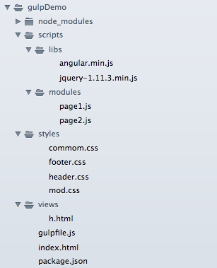
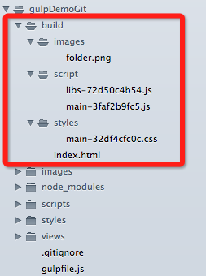

#GulpJs入门与实践

##一、什么是gulpJs
用自动化构建工具增强你的工作流程！

特点易于使用，构建快速，插件高质，易于学习

官方网站: [gulp](http://gulpjs.com/)

##二、gulpjs在实际项目中的使用（DMC为例）

当前前端开发的工作流？

###2.1 安装

需要安装 nodejs、npm（这个不再描述）

全局安装

	$ npm install --global gulp

在你的项目的 devDependencies 下安装gulp,
	
	$ npm install --save-dev gulp

在你项目的根目录下创建 gulpfile.js 文件

	var gulp = require('gulp');

	gulp.task('default', function() {

		// place code for your default task here
  
	});

运行 gulp

	$ gulp

###2.2 开发状态
####2.2.1 启动http环境，并且设置api接口的反向代理
DMC的所有接口采用了jsonp的方式，不存在跨域的说法。DMS项目我们用到了json的方式传递数据，因api接口的域名和实际本地开发的域名不相同，所以有跨域的情况出现

DMS本地开发域名： `dms.dev-adtime.com`

DMS接口api的域名： `api.dev.adt100.net`

要将 `api.dev.adt100.net/dmc` 都转成 `dms.dev-adtime.com/dmc`

原来的做法：`nginx` 设置反向代理

现在的做法：

1. `browser-sync` 启动 `http`环境

2. `http-proxy-middleware` 设置反向代理

安装：

	$ npm install browser-sync http-proxy-middleware
	
gulpfile文档配置

	var gulp = require('gulp'); // 主要
	var browserSync = require('browser-sync');	
	var proxyMiddleware = require('http-proxy-middleware');
	
	// http环境，接口反向代理
	gulp.task('browser-sync', function() {

		// 多个地址的反向代理
		var proxy163 = proxyMiddleware('/f2e', {
	    	target: 'http://img1.cache.netease.com',
	    	headers: {
	    		host:'img1.cache.netease.com'	// 这个挺关键
	    	}
	  	});

		var proxyAdtime = proxyMiddleware('/apps', {
	    	target: 'http://cdn.adt100.com',
	    	headers: {
	    		host:'cdn.adt100.com'
	    	}
	  	});
		browserSync({
	    	server: {
	        	baseDir: "./",
	        	port: 80,
	        	middleware: [proxy163, proxyAdtime]
	    	}
		});
	});	
	
设置css文件的livereload	

	// css文件重新在浏览器渲染
	gulp.task('css', function() {
    	gulp.src('./styles/*.css')
        	.pipe(browserSync.reload({
            	stream: true
        	}));
	});

	// 监控css文件的改变
	gulp.task('watch', function() {
    	gulp.watch('./styles/*.css', ['css']);
	});
	
配置开发环境gulp项

	gulp.task('dev', ['browser-sync', 'watch']);

在终端执行

	$ gulp dev

###2.3 部署发布

目录结构

####2.3.1 压缩合并js，减少http请求，加快网页生成速度

使用 `gulp-usemin` 合并、压缩css、js文件并且添加版本号

`html` 文件部分

	<!-- build:css styles/main.css -->
	<link rel="stylesheet" href="styles/common.css">
	<link rel="stylesheet" href="styles/header.css">
	<link rel="stylesheet" href="styles/sidermod.css">
	<link rel="stylesheet" href="styles/footer.css">
	<!-- endbuild -->

最终会在 style 文件夹下生成 合并后的 `main.css` 文件

`gulpfile` 文件部分

	// 引入gulp-usemin等插件
	var usemin = require('gulp-usemin');
	var uglify = require('gulp-uglify');
	var rev = require('gulp-rev');
	var minifyHtml = require('gulp-minify-html');
	
	// 压缩合并静态文件
	gulp.task('usemin', function(){
    // 压缩index文件
    gulp.src('./index.html')
        .pipe(usemin({
            indexCSS: [minifyCss(), 'concat', rev()],	// 压缩css、合并、添加版本号
            jsLibs: [rev()],
            jsMain: [uglify(), rev()],		// 压缩js，并且添加版本号
            html: [minifyHtml({empty:true, quotes: true})]	// 压缩静态html文件
        }))
        .pipe(gulp.dest('./build'));   
	});

最终打包目录

##参考文档
1. [Browsersync + Gulp.js](http://www.browsersync.io/docs/gulp/)

2. [gulp-usemin](https://github.com/zont/gulp-usemin)

